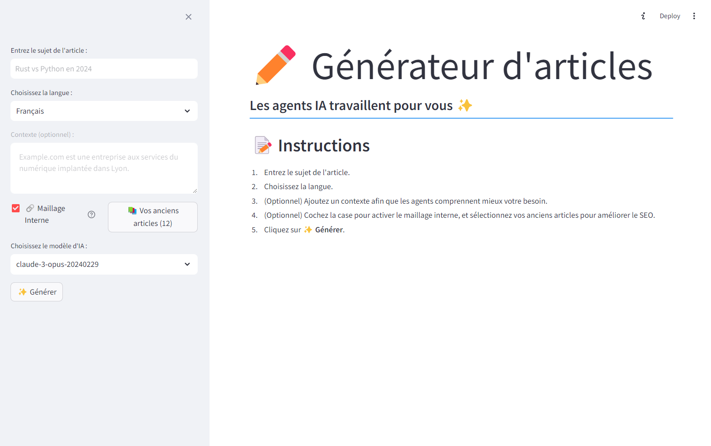

# StackBlog: StackOverflow Blog Generator



This project is an automated solution for generating detailed and informative blog posts based on Stack Overflow discussions. Using CrewAI and multiple AI agents, it
searches for relevant Stack Overflow posts, extracts the most important information, and compiles it into a comprehensive and engaging blog post.

Can be deployed on Heroku in a few steps 🚀

Example of generated blog post: [Next.js vs React : Quelle est la meilleure solution pour votre projet ?](posts/blog_post_React_vs_NextJS_2024_05_31.md)

# Setup

### Prerequisites

```sh
# Clone the repository
git clone https://github.com/SuperMuel/blog_generator_from_stackoverflow.git

cd blog_generator_from_stackoverflow

# Create a virtual environment
python -m venv venv

# Activate the virtual environment
source venv/bin/activate   # On Windows, use `venv\Scripts\activate`

# Install dependencies
pip install -r requirements.txt
```

### API Keys

You need an Anthropic API key to generate blog posts. You can get one by signing up at [Anthropic](https://www.anthropic.com/api).

To search for StackOverflow posts, you need a Serper.dev API key. You can get one by signing up at [Serper.dev](https://serper.dev/).

Once you have the API keys, copy the `.env.example` file to `.env` and add the API keys for the services you wish to use.

# Run locally

## Command line

```sh
python generate_article "Your topic"
```

## Streamlit app

```sh
streamlit run app.py
```

# Run the API Server

## Locally

1. **Start the Fastapi application**:

   ```sh
   fastapi dev api/api.py
   ```

2. **Test the API**:

You can access the interactive API documentation at `http://localhost:5000/docs` and test the `/generate-article` endpoint.

## On Heroku

### Setup Heroku

If you haven't already, install the [Heroku CLI](https://devcenter.heroku.com/articles/heroku-cli#install-the-heroku-cli).

1. **Login to Heroku**:

```sh
heroku login
```

2. **Create a new Heroku app**:

Inside the project directory, run:

```sh
heroku create your-app-name
```

3. Set the environment variables on Heroku:

```sh
python api/scripts/heroku_setup_env.py
```

4. **Deploy the application**:

```sh
git push heroku main
```

5. **Scale the application**:

This will start a web dyno to serve the application.

```sh
heroku ps:scale web=1
```

6. **Open the application**:

```sh
heroku open
```
